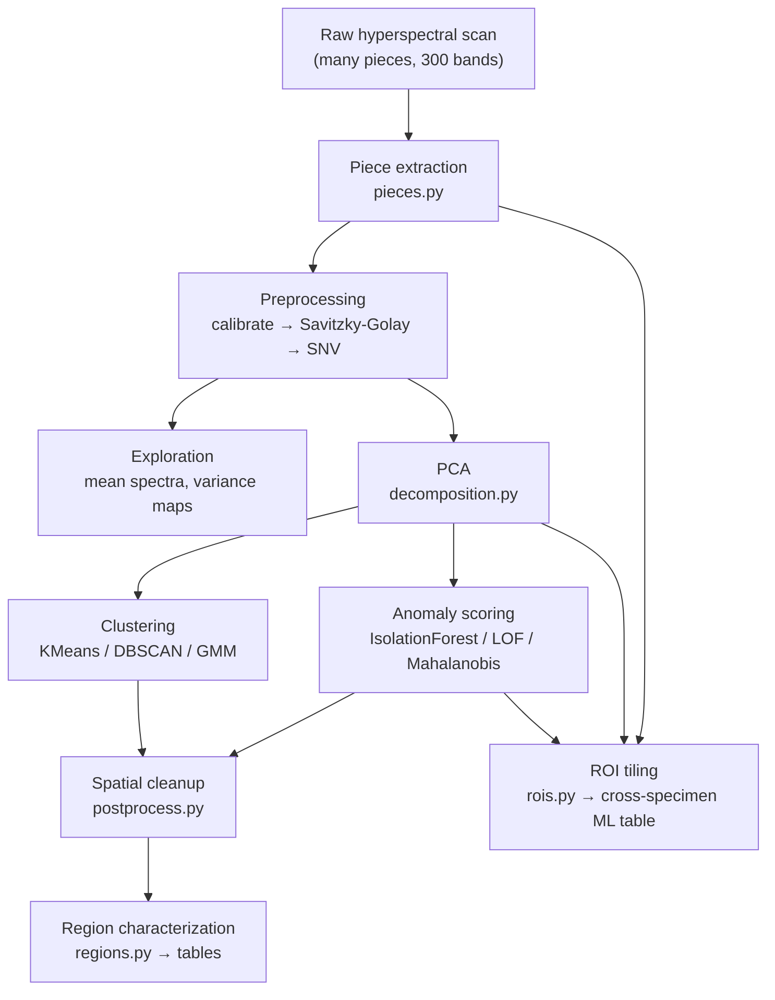

# HSI — Unsupervised Spectral Anomaly Detection for SiO₂ Thin Films

Find and map **spectrally unusual regions** in semiconductor thin films from
hyperspectral images — **without** any defect labels, reference spectra, or prior
knowledge of where problems are. Bare silicon acts as a "what normal looks like"
baseline; processed SiO₂ pieces are screened for anomalies.

> We are **not** detecting defects. We are detecting **spectral anomalies** —
> regions worth a closer look with SEM/AFM/Raman later.

---

## 🧒 The dumbed-down version

Imagine you photograph a dozen wafer chips, but instead of a normal camera that
sees Red/Green/Blue, your camera measures **300 colors** at every pixel. Each
pixel becomes a little "spectral fingerprint."

We want to answer one question:

> **Which spots on these chips have a weird fingerprint compared to the rest?**

We don't know what "weird" looks like ahead of time, and we have no answer key.
So the program:

1. **Cuts the chips apart.** One photo has many chips sitting in a dish. The
   program finds each chip and crops it out on its own — using the fingerprints,
   not brightness, so it works whether the dish is black or white.
2. **Cleans the fingerprints.** Removes camera noise and lighting differences so
   only the real signal remains.
3. **Learns what "normal" looks like** from the bulk of the material (most of a
   chip is normal film), plus a set of plain silicon chips as a reference point.
4. **Flags the oddballs.** Any spot whose fingerprint is unusual gets a high
   "anomaly score." We paint those scores back onto the chip as a heatmap and
   circle the clusters of weird pixels.
5. **Writes it all down.** A table of every flagged region (how big, what shape,
   how weird) and a spreadsheet where each little patch of chip is one row.

Think of it as a **smoke detector for wafers**: it doesn't tell you *what* the
problem is, it just says "*something* here smells off — go investigate." That
saves expensive lab time by pointing the microscope only at the interesting spots.

Analogy: it's like a teacher who has never seen the answer key, noticing that one
student's essay reads very differently from everyone else's — not judging if it's
*wrong*, just flagging it as *unusual and worth reading closely*.

---

## 🔬 The quick technical overview

The pipeline is a chain of swappable stages. Each stage is one Python module with
one config object, so you can retune or replace any step without touching the rest.



- **Input:** ENVI `.bip`/`.bil` cubes from a Resonon Pika L (VNIR, 300 bands,
  ~368–1008 nm). Each scan holds *several physical pieces* on a dish.
- **Baseline:** bare-silicon pieces define the control population.
- **Two granularities:** (1) per-pixel maps painted back onto each piece, and
  (2) a per-ROI table (each fixed patch = one sample) with **specimen-level
  train/test splits** to avoid spatial-autocorrelation leakage.
- **Everything is spectral**, never RGB — RGB panels are only for human viewing.

### Quickstart

```bash
# 1. Build the sample inventory + organized Specimen→Piece→ROI tree in data/
python -m hsi_workflow.run_organize

# 2. Stage-4 exploratory figures — pass BOTH materials for the Si-vs-SiO₂ check
python -m hsi_workflow.run_explore  --dataset sio2_bare_si sio2_dish_black

# 3. Full analysis: PCA → clustering → anomaly (within-film + Si-contrast) →
#    regions → specimen-split evaluation → report.md
python -m hsi_workflow.run_analyze  --target sio2_dish_black --baseline sio2_bare_si
```

Step 1 writes `data/samples.csv` (the sample database), `data/manifest.json`, and
`data/organized/<dataset>/<piece_id>/` folders — each with the cropped piece cube,
a `rois/` subfolder of cropped ROI cubes, and metadata. Analysis outputs land
under `out/workflow/{explore,analyze}/...`, including the Stage-11 `report.md`.

**Interactive tuning** (find good filter/mask/ROI settings visually, then press
`p` to print paste-ready config snippets):

```bash
python debug_preprocess.py --dataset sio2_bare_si     # SG window/SNV/baseline tuner
python debug_masks.py      --dataset sio2_dish_black  # mask morphology + ROI grid tuner
# both accept --crop R0 R1 C0 C1 for big scans and --demo for a synthetic cube
```

Plus `notebooks/playground.ipynb` for ad-hoc exploration with the same API.

> Run everything in the `hsi` conda env: `conda run -n hsi python -m hsi_workflow...`

---

## 📚 Documentation

Detailed docs live in [`docs/`](docs/):

| Doc | What it covers |
|---|---|
| [overview.md](docs/overview.md) | The research objective, the old→new shift, the hypothesis |
| [pipeline.md](docs/pipeline.md) | All 12 stages explained, mapped to modules, with the data flow |
| [architecture.md](docs/architecture.md) | Module/config design and how to extend it (registries, configs) |
| [extraction.md](docs/extraction.md) | Piece extraction + ROI tiling in depth (the novel front-end) |
| [analysis.md](docs/analysis.md) | PCA, clustering, anomaly scoring, cleanup, region tables |
| [usage.md](docs/usage.md) | Every CLI, its arguments, and how to read the outputs |
| [tuning.md](docs/tuning.md) | Knobs, gotchas, known limitations, and future work |

---

## Repository layout

```
hsi_workflow/         the pipeline package (see docs/architecture.md)
data/                 sample database + organized Specimen→Piece→ROI tree (run_organize)
docs/                 detailed documentation
notebooks/            playground.ipynb — ad-hoc exploration scratchpad
debug_preprocess.py   interactive filter/window tuner (sliders, live noise metrics)
debug_masks.py        interactive mask/extraction/ROI tuner
band_viewer.py        multi-cube band viewer (calibration sanity checks)
legacy/               earlier LIG analysis (RX/Mahalanobis, PCA/KMeans) — reference only
reference/            external reference code (not used by the pipeline)
out/                  generated figures and tables (out/legacy = pre-revision outputs)
Revised Research Objective.md   the source specification this implements
requirements.txt      numpy, scipy, scikit-learn, scikit-image, matplotlib, spectral, pandas
```
