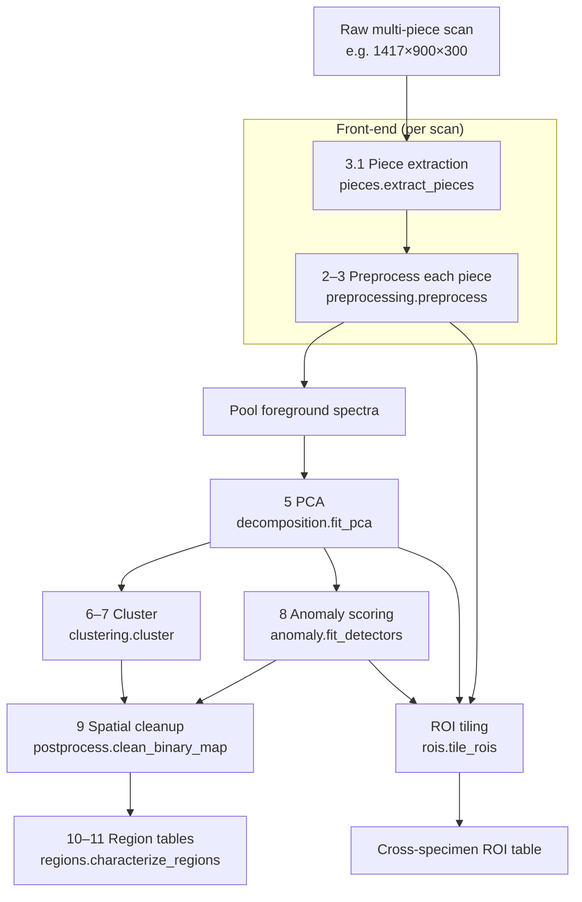

# The Pipeline — Stage by Stage

This walks through every stage of the workflow, what it does, *why*, and which
code implements it. Stage numbers follow `Revised Research Objective.md`.

## Data flow at a glance

The orchestrator that runs this is [`pipeline.py`](../hsi_workflow/pipeline.py)
(`run_workflow`, `prepare_pieces`, `analyze_piece`).

---

## Stage 1 — Data acquisition (external)

Hyperspectral cubes `(X, Y, λ)` where each pixel is a reflectance spectrum.
Hardware: Resonon Pika L, VNIR, 300 bands, ~368–1008 nm. For each scene you ideally
capture a **dark**, a **white reference**, and the **sample**. Not part of the code.

## Stage 2 — Radiometric calibration

**What:** convert raw detector counts to reflectance with
`R = (S − D) / (W − D)`, exposure-normalized because the white/dark references
were captured at different shutter times.

**Why:** makes pixels comparable across scans and puts values on a physical scale.

**Code:** `preprocessing.calibrate_reflectance`. References are loaded once and
cached by `io.load_reference_spectrum` (they are ~750 MB each). Saturated pixels
(hit the sensor ceiling) are flagged by `preprocessing.saturation_mask` and
excluded downstream.

## Stage 3 — Preprocessing

Runs on each **piece** sub-cube (see Stage 3.1). Implemented in
`preprocessing.preprocess`, order:

- **3.1 Background removal** — restrict analysis to the piece mask (the dish/holder
  is already excluded by piece extraction).
- **3.2 Spectral smoothing** — `savgol_smooth` (Savitzky-Golay). Fits a low-order
  polynomial in a sliding spectral window: removes sensor noise while *preserving*
  peak position/shape far better than a moving average.
- **3.4 Baseline correction** *(optional)* — `baseline_correct(method="poly")`
  removes slow scattering offsets per pixel. Off by default.
- **3.3 Normalization** — `snv` (Standard Normal Variate): per-pixel mean/std
  normalization. Removes brightness/illumination differences so downstream stages
  key on **spectral shape**, not intensity.

The resulting **SG + SNV reflectance** is the analysis cube for all later stages.

> **Note:** SNV makes each pixel zero-mean/unit-variance. That's exactly what you
> want for ML, but it means "per-pixel variance across bands" ≈ 1 everywhere — so
> the Stage-4 *variance map* is computed on **reflectance** (SNV off) instead. See
> [tuning.md](tuning.md).

## Stage 3.1 — Piece extraction (the new front-end)

**What:** split one raw scan (many pieces on a dish) into individual **piece
sub-cubes**. Covered in depth in [extraction.md](extraction.md).

**Why:** every downstream stage reasons about one physical piece at a time, and
ROIs must come from *within* a piece.

**Code:** `pieces.extract_pieces` → list of `Piece` objects. Fully spectral:
estimates the dish spectrum from a border frame, flags foreground by spectral
angle/Mahalanobis, cleans with morphology, labels connected components, crops each.

## Stage 4 — Exploratory visualization

**What:** before any ML, *look at the data*. Per piece: mean spectrum, band images
at a few wavelengths, RGB composite, and a **spectral variance map**. Plus an
overlay of mean spectra grouped by material (Si vs SiO₂).

**Why:** this replaces the missing reference library — it's how you build intuition
and confirm the Si-low / SiO₂-high variance expectation.

**Code:** `explore.py` (`save_piece_exploration`, `save_material_mean_spectra`,
`spectral_variance_map`), driven by `run_explore.py`.

## Stage 5 — Dimensionality reduction (PCA)

**What:** compress 300 bands to a few principal components (default 3). Fit once on
a pooled, subsampled set of spectra so a single basis is shared across pieces.

**Why:** clustering and anomaly scoring are cheaper and more stable in a compact,
de-noised feature space. Also answers "is there anything interesting before ML?"

**Code:** `decomposition.fit_pca` → `PcaModel` (`transform`, `score_image`,
`explained_variance_ratio`, `loadings`). Deliverables: explained-variance chart +
loading curves (`viz.save_pca_summary`), PC score maps. We observed PC1 ≈ 84%.

## Stage 6–7 — Clustering + spatial mapping

**What:** cluster the PCA scores into naturally occurring spectral populations,
then paint the labels back onto the image as a **cluster map**.

**Why:** reveals spatially coherent spectral regions. We deliberately **do not**
name them ("vacancy", "crack") — they are just distinct populations.

**Code:** `clustering.cluster` (registry of `kmeans` / `dbscan` / `gmm`),
`cluster_map` (reshape to image), `cluster_metrics` (silhouette, Davies-Bouldin,
Calinski-Harabasz). Default KMeans, k=4.

## Stage 8 — Anomaly scoring

**What:** score every pixel/ROI by how unusual its spectrum is, producing an
**anomaly heatmap**. Detectors are fit on the "normal" population and used to score
everything.

**Why:** this is the scientific core — flag spectrally unusual regions without
labels.

**Code:** `anomaly.py` — a registry of detectors (`iforest`, `lof`, `mahalanobis`,
`ocsvm`), each with `fit(normal)` / `score(X)`. `fit_detectors`, `anomaly_map`,
`flag_threshold`, `to_probability`. Every run produces **both**
products: within-film maps (detectors fit per `AnomalyConfig.fit_on`, default the
film's own majority — these drive the flagged regions) and the silicon-baseline
contrast map (always computed; the document's literal "relative to silicon
baseline" deliverable). See [analysis.md](analysis.md) for why.

## Stage 9 — Spatial postprocessing

**What:** clean the pixel-level flag map — median filter, morphological opening,
drop tiny connected components.

**Why:** removes isolated noisy pixels so only contiguous, real regions remain.

**Code:** `postprocess.clean_binary_map`, `postprocess.label_regions`. Flags are
also clamped to the piece mask so spatial filters can't bleed onto the dish.

## Stage 10–11 — Quantitative maps + region characterization

**What:** measure each surviving region — area, perimeter, compactness, physical
mean reflectance, spectral variance, distance from the silicon baseline
(Mahalanobis), PCA coordinates, anomaly score — into a **region table**. Also the
quantitative maps: PC score maps, cluster map, spectral-distance map (distance
from the piece's mean spectrum), and the 0–1 anomaly-probability map.

**Why:** turns pictures into numbers you can rank and compare, and describes each
region *without* labeling it (scientifically honest).

**Code:** `regions.characterize_regions` → `RegionStats` → `regions_to_table`,
plus `regions.spectral_distance_map` and `anomaly.to_probability`. All panels are
drawn into the 9-panel `viz.save_analysis_figure`. The Stage-11 **final report**
(`report.md`: per-piece stats, edge-share diagnostics, the document's questions
answered) is generated by `report.write_report` at the end of `run_analyze`.

## Stage 12 — Future validation (out of scope)

Representative anomalous regions may later be examined with SEM/AFM/Raman/XPS/TEM to
determine the *physical* origin. Not part of the current pipeline.

---

## The ROI track (cross-cutting)

Alongside the per-pixel maps, each piece is tiled into fixed patches (default
32×32). Each patch → one **ROI sample** (mean spectrum + features), assembled into a
table where the split holds out **whole specimens** to prevent leakage. See
[extraction.md](extraction.md#roi-tiling) and `rois.py`.

## Metric expectations summary

| Stage | Metric | Rough expectation |
|---|---|---|
| PCA | PC1 variance | Large (we saw ~84%) |
| Clustering | Silhouette | 0.4–0.8 (we saw 0.33–0.53) |
| Anomaly | Anomalous fraction | Small, localized (we saw 0–4%) |
| Baseline | Si spectral variance | Low (~0.001), uniform |
